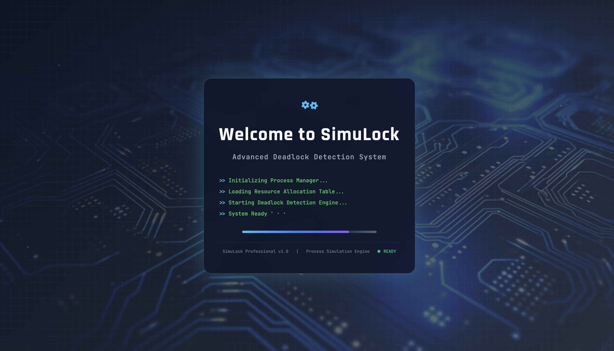
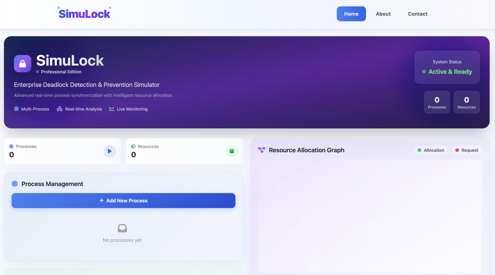
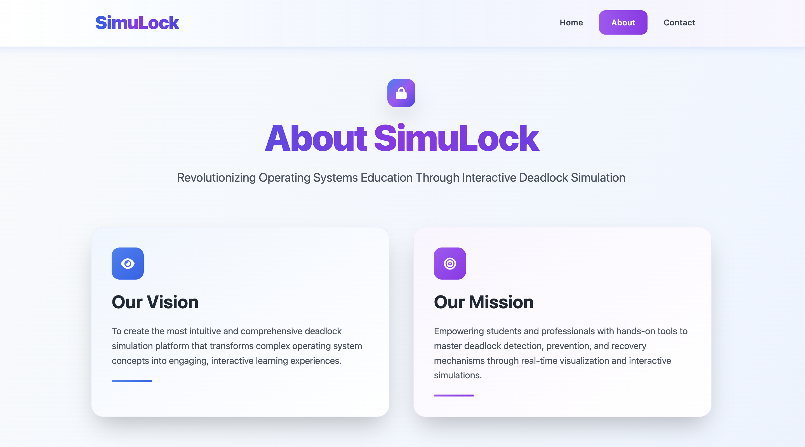
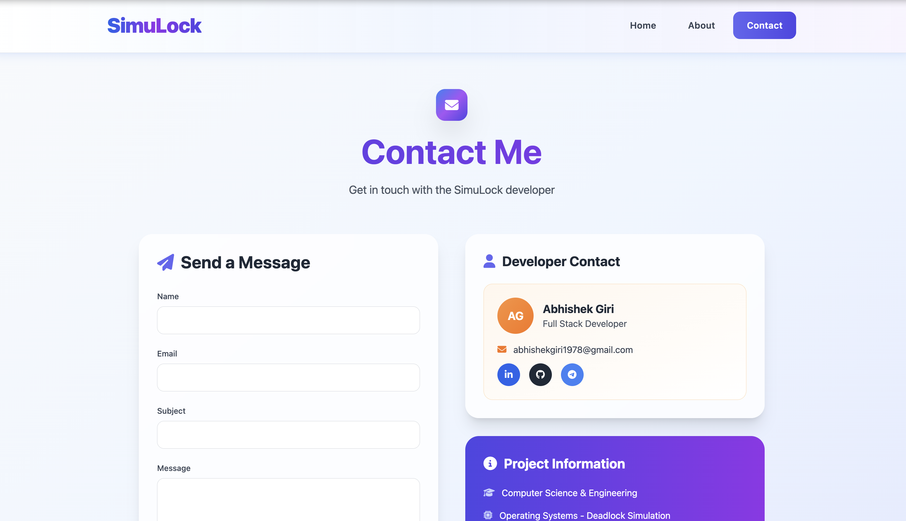

<h1 align="center">🔒 SimuLock — Advanced Deadlock Detection Simulator</h1>

<p align="center">
  🚀 An interactive web-based simulator for understanding, detecting, and preventing deadlocks in operating systems using binary semaphores, with <b>real-time visualization</b> and intelligent resource allocation algorithms.
</p>

<p align="center">
  
  
  
  
  
  
</p>
<br>

---

## 📖 Problem Statement
Operating system students face significant challenges in understanding deadlock concepts, process synchronization, and resource allocation mechanisms. Traditional theoretical approaches lack hands-on experience and visual feedback required for comprehensive learning.

<br>

---

## 💡 Our Solution
SimuLock is a comprehensive educational platform built to:

- 🔍 **Real-time Deadlock Detection** using advanced graph algorithms
- 📊 **Interactive Process Management** with visual state tracking
- 🎮 **Auto Simulation** for quick demonstration and learning
- 📈 **Live Resource Allocation** with binary semaphore implementation
- 🌐 **Web-based Interface** accessible from any modern browser
<br>

---  

## 🚀 Features

✅  **Real-time deadlock detection** with cycle detection algorithms  
✅  **Interactive wait-for graph** visualization with live updates  
✅  **Process state management** (Ready/Running/Waiting/Deadlocked)  
✅  **Binary semaphore** resource allocation system  
✅  **Auto simulation** for quick deadlock scenario creation  
✅  **Comprehensive logging** with timestamped event history  
✅  **Responsive design** with modern UI/UX  
✅  **LockSmith Character Guide** with voice assistance  
✅  **Professional contact system** with email integration  

<br>

---  

## 🛠️ Tech Stack

<div align="center">

<table>
<thead>
<tr>
<th>🖥️ Technology</th>
<th>⚙️ Description</th>
</tr>
</thead>
<tbody>
<tr>
<td></td>
<td>Core programming language for backend logic</td>
</tr>
<tr>
<td></td>
<td>Lightweight web framework and API server</td>
</tr>
<tr>
<td></td>
<td>Real-time bidirectional communication</td>
</tr>
<tr>
<td></td>
<td>Graph algorithms for deadlock detection</td>
</tr>
<tr>
<td></td>
<td>Interactive frontend functionality</td>
</tr>
<tr>
<td></td>
<td>Modern utility-first CSS framework</td>
</tr>
<tr>
<td></td>
<td>Semantic markup and structure</td>
</tr>
</tbody>
</table>

</div>

<br>

---

## 📁 Project Directory Structure

```
SimuLock/
├── 📂 backend/                     # 🔧 Flask backend service
│   ├── 📂 modules/                 # 🧩 Core simulation modules
│   │   ├── 📄 __init__.py          # 📦 Package initialization
│   │   ├── 📄 banker.py            # 🏦 Banker's algorithm implementation
│   │   ├── 📄 deadlock_detector.py # 🔍 Deadlock detection algorithms
│   │   ├── 📄 process.py           # 🔄 Process management
│   │   ├── 📄 resource.py          # 📦 Resource allocation
│   │   ├── 📄 semaphore.py         # 🔒 Binary semaphore implementation
│   │   └── 📄 simulator.py         # 🎮 Main simulation controller
│   ├── 📄 .env                     # 🔐 Environment variables
│   ├── 📄 app.py                   # 🚀 Flask application server
│   ├── 📄 build.sh                 # 🔨 Render build script
│   ├── 📄 contact_handler.py       # 📧 Email contact system
│   ├── 📄 Procfile                 # 🚀 Render deployment config
│   └── 📄 requirements.txt         # 📋 Python dependencies
├── 📂 docs/                        # 📸 Documentation and screenshots
│   ├── 📄 About_Page.png           # 📸 About page screenshot
│   ├── 📄 Contact_Page.png         # 📸 Contact page screenshot
│   ├── 📄 Home_Page.png            # 📸 Main simulator screenshot
│   └── 📄 Loading_Page.png         # 📸 Loading screen screenshot
├── 📂 frontend/                    # 🎨 Web frontend interface
│   ├── 📂 assets/                  # 🖼️ Images and media files
│   │   ├── 📄 101.png              # 👤 LockSmith character face 1
│   │   ├── 📄 102.png              # 👤 LockSmith character face 2
│   │   ├── 📄 103.png              # 👤 LockSmith character face 3
│   │   ├── 📄 104.png              # 👤 LockSmith character face 4
│   │   ├── 📄 105.png              # 👤 LockSmith character face 5
│   │   ├── 📄 AbhishekGiri.jpg     # 💻 Developer photo
│   │   └── 📄 background.png       # 🌅 Background image
│   ├── 📂 css/                     # 🎨 Stylesheets
│   │   └── 📄 style.css            # 🎨 Custom styles and animations
│   ├── 📂 js/                      # ⚡ JavaScript modules
│   │   ├── 📄 app.js               # 🔗 Socket.IO and API communication
│   │   ├── 📄 graph.js             # 📊 Graph visualization utilities
│   │   └── 📄 simulator.js         # 🎮 Simulation control logic
│   ├── 📄 .env                     # 🔐 Frontend environment variables
│   ├── 📄 about.html               # ℹ️ About page
│   ├── 📄 contact.html             # 📞 Contact information
│   ├── 📄 index.html               # 🏠 Main application interface
│   └── 📄 loading.html             # ⏳ Loading screen
├── 📄 .gitignore                   # 🚫 Git ignore rules
├── 📄 .mailmap                     # 👤 Git author mapping
├── 📄 LICENSE                      # 📄 MIT License
├── 📄 README.md                    # 📖 Project documentation
├── 📄 start.sh                     # 🚀 Automated startup script
└── 📄 vercel.json                  # ⚡ Vercel deployment configuration
```
<br>

## 📸 Preview Images

| 📍 Page / Feature | 📸 Screenshot |
|:------------------|:--------------|
| Loading Screen |  |
| Main Simulator |  |
| About Page |  |
| Contact Page |  |

<br>

---

## 📦 How to Run

### 📌 Prerequisites
- ✅ **Python 3.8+** installed
- ✅ **pip** package manager
- ✅ **Modern web browser** (Chrome, Firefox, Safari, Edge)

<br>

---  

### 🚀 Quick Start

1. Clone and setup environment:

   ```bash
   git clone https://github.com/abhishekgiri04/SimuLock.git
   cd SimuLock
   
   # Run the automated startup script
   ./start.sh
   ```

2. Access the application:

   ```
   http://localhost:5004
   ```

### 🔧 Manual Setup

```bash
# Clone the repository
git clone https://github.com/abhishekgiri04/SimuLock.git
cd SimuLock

# Navigate to backend directory
cd backend

# Create virtual environment
python3 -m venv venv

# Activate virtual environment
# Windows:
venv\Scripts\activate
# Mac/Linux:
source venv/bin/activate

# Install dependencies
pip install -r requirements.txt

# Start the server
python app.py
```
<br>

---

## 📖 Core Components

### Backend Components
* **app.py** — Flask server with Socket.IO integration and API endpoints
* **deadlock_detector.py** — Wait-for graph and cycle detection algorithms
* **process.py** — Process state management and synchronization
* **resource.py** — Binary semaphore resource allocation system
* **simulator.py** — Main simulation controller and logic
* **banker.py** — Banker's algorithm for deadlock prevention
* **contact_handler.py** — Professional email contact system

### Frontend Components
* **index.html** — Interactive web interface with embedded JavaScript
* **graph.js** — SVG-based graph visualization utilities
* **app.js** — Real-time communication and UI updates
* **simulator.js** — Simulation control logic

<br>

---

## 🌐 API Endpoints

```bash
# Main Application Routes
GET  /                     # Loading page
GET  /index                # Main simulator interface
GET  /about                # About page
GET  /contact              # Contact page

# Simulation API
POST /api/add_process      # Create new process
POST /api/add_resource     # Create new resource
POST /api/request_resource # Request resource allocation
POST /api/release_resource # Release allocated resource
POST /api/auto_simulate    # Run automatic deadlock scenario
POST /api/reset            # Reset simulation state
GET  /api/processes        # Get current system state

# Advanced Features
POST /api/detect           # Manual deadlock detection
POST /api/recover          # Deadlock recovery strategies
POST /api/contact          # Send contact message
```
<br>

---

## 🧪 Testing

```bash
# Test server startup
cd backend
python app.py
# Should show: "🚀 Server starting on http://localhost:5004"

# Test API endpoints
curl http://localhost:5004/
curl http://localhost:5004/api/processes
curl -X POST http://localhost:5004/api/auto_simulate
```

## ⚠️ Common Issues

**Port 5004 already in use:**
```bash
# Windows
netstat -ano | findstr :5004
# Mac/Linux
lsof -ti:5004 | xargs kill
```

**Module not found errors:**
```bash
cd backend && pip install -r requirements.txt
```

**Virtual environment issues:**
```bash
cd backend && rm -rf venv && python3 -m venv venv
source venv/bin/activate && pip install -r requirements.txt
```
<br>

---

## 🎮 Usage Guide

### 🚀 Quick Demo (30 seconds)
1. **Click "Auto Simulate"** button
2. **Watch** automatic deadlock creation and detection
3. **Observe** the red deadlock alert and graph visualization
4. **Listen** to LockSmith character guidance

### 🔧 Manual Deadlock Creation
```
1. Click "Add Process" twice (creates P1, P2)
2. Click "Add Resource" twice (creates R1, R2)
3. P1 requests R1 → Click "Request" (P1 gets R1)
4. P2 requests R2 → Click "Request" (P2 gets R2)
5. P1 requests R2 → Click "Request" (P1 waits for R2)
6. P2 requests R1 → Click "Request" (P2 waits for R1)
7. Click "Detect Deadlock" → DEADLOCK DETECTED!
```

### 🎯 Key Features to Explore
- **LockSmith Character** - Interactive guide with voice assistance
- **Real-time Graph** - Visual representation of process-resource relationships
- **Process Control Block** - Click on processes to view detailed PCB information
- **Auto Detection** - Toggle automatic deadlock detection on/off
- **Recovery Strategies** - Test different deadlock recovery methods
- **Professional Logging** - Download or copy simulation logs

<br>

---

## 📊 Performance Metrics

- **⚡ Real-time Detection** — Instant deadlock identification (<100ms)
- **🎨 Interactive Graphs** — Live wait-for graph updates
- **🔄 Process Management** — Multiple process state tracking
- **🔒 Resource Allocation** — Binary semaphore implementation
- **🎓 Educational Focus** — Designed for learning and understanding
- **📱 Responsive Design** — Works on desktop, tablet, and mobile
- **🌐 Cross-browser** — Compatible with all modern browsers

<br>

---

## 🌱 Future Enhancements
- 📱 **Enhanced Mobile Support** — Improved mobile device experience
- 🔄 **Advanced Algorithms** — Banker's algorithm full implementation
- 📊 **Analytics Dashboard** — Detailed performance metrics and statistics
- 🎓 **Educational Modules** — Guided tutorials and interactive lessons
- 🌐 **Multi-user Support** — Collaborative simulation sessions
- 🔊 **Audio Feedback** — Enhanced sound effects and notifications
- 📈 **Performance Monitoring** — Real-time system performance tracking

<br>

---  

## 📞 Help & Contact  

> 💬 *Got questions or need assistance with SimuLock?*  
> We're here to help with integration and customization!

<div align="center">

<b>👤 Abhishek Giri</b>  
<a href="https://www.linkedin.com/in/abhishek-giri04/">
  
</a>  
<a href="https://github.com/abhishekgiri04">
  
</a>  
<a href="https://t.me/AbhishekGiri7">
  
</a>

<br/>

---

## 📄 License

This project is licensed under the MIT License - see the [LICENSE](LICENSE) file for details.

---

**🔒 Built with ❤️ for Operating Systems Education**  
*Transforming Deadlock Learning Through Interactive Simulation*

</div>

---

<div align="center">

**© 2025 SimuLock - Advanced Deadlock Detection Simulator. All Rights Reserved.**

</div># SimuLock
